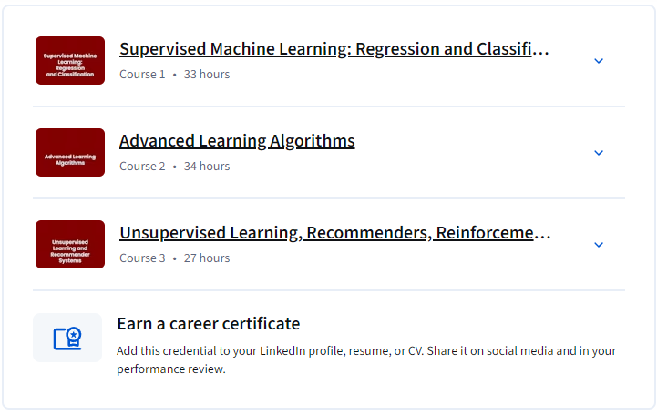

# Machine Learning Specialization – Coursera Assignments

This repository contains my solutions to assignments from the **Machine Learning Specialization by DeepLearning.AI** on Coursera.

Currently includes:
- ✅ **Course 1: Supervised Machine Learning: Regression and Classification** – Completed (No assignments provided in this course)
- ✅ **Course 2: Advanced Learning Algorithms** – Completed
- ✅ **Course 3: Unsupervised Learning, Recommenders, and Reinforcement Learning** – Completed

---

## 📂 Folder Structure

[Machine-Learning-Specialization-Coursera-Assignments](https://github.com/AmmarYasserAI-2/Machine-Learning-Specialization-Coursera-Assignments)  
│  
├── [Advanced-Learning-Algorithms](https://github.com/AmmarYasserAI-2/Machine-Learning-Coursera-Assignments/tree/main/Advanced%20Learning%20algorithms%20course)                 # Course 2 – Completed  
│   ├── [1-Neural-Networks-for-Binary-Classification](https://github.com/AmmarYasserAI-2/Machine-Learning-Coursera-Assignments/tree/main/Advanced%20Learning%20algorithms%20course/1.%20Neural%20Networks%20for%20Binary%20Classification)  
│   ├── [2-Neural-Networks-for-Multiclass-Classification](https://github.com/AmmarYasserAI-2/Machine-Learning-Coursera-Assignments/tree/main/Advanced%20Learning%20algorithms%20course/2.%20Neural%20Networks%20for%20Multiclass%20Classification)  
│   ├── [3-Advice-for-Applying-Machine-Learning](https://github.com/AmmarYasserAI-2/Machine-Learning-Coursera-Assignments/tree/main/Advanced%20Learning%20algorithms%20course/3.%20Advice%20for%20Applying%20Machine%20Learning)  
│   └── [4-Decision-Trees](https://github.com/AmmarYasserAI-2/Machine-Learning-Coursera-Assignments/tree/main/Advanced%20Learning%20algorithms%20course/4.%20Decision%20Trees)  
│  
└── [Unsupervised-Recommenders-RL](https://github.com/AmmarYasserAI-2/Machine-Learning-Coursera-Assignments/tree/main/Unsupervised%20Learning%2C%20Recommenders%2C%20and%20Reinforcement%20Learning)  
    ├── [1-k-means](https://github.com/AmmarYasserAI-2/Machine-Learning-Coursera-Assignments/tree/main/Unsupervised%20Learning%2C%20Recommenders%2C%20and%20Reinforcement%20Learning/1.%20k-means)  
    ├── [2-Anomaly-Detection](https://github.com/AmmarYasserAI-2/Machine-Learning-Coursera-Assignments/tree/main/Unsupervised%20Learning%2C%20Recommenders%2C%20and%20Reinforcement%20Learning/2.%20Anomaly%20Detection)  
    ├── [3-Collaborative-Filtering-Recommender-Systems](https://github.com/AmmarYasserAI-2/Machine-Learning-Coursera-Assignments/tree/main/Unsupervised%20Learning%2C%20Recommenders%2C%20and%20Reinforcement%20Learning/3.%20Collaborative%20Filtering%20Recommender%20Systems)  
    ├── [4-Deep-Learning-for-Content-Based-Filtering](https://github.com/AmmarYasserAI-2/Machine-Learning-Coursera-Assignments/tree/main/Unsupervised%20Learning%2C%20Recommenders%2C%20and%20Reinforcement%20Learning/4.%20Deep%20Learning%20for%20Content-Based%20Filtering)  
    └── [5-Reinforcement-Learning](https://github.com/AmmarYasserAI-2/Machine-Learning-Coursera-Assignments/tree/main/Unsupervised%20Learning%2C%20Recommenders%2C%20and%20Reinforcement%20Learning/5.%20Reinforcement%20Learning)  

##  How to Use

* Each numbered folder contains Jupyter notebooks with assignments, plus quiz notes.
* Clone the repository and explore notebooks under each course for implementation details and results.

* The **Lunar Lander** project (inside the Reinforcement Learning folder) demonstrates how I trained an agent using **Q-Learning** to land a spacecraft in the [OpenAI Gym](https://www.gymlibrary.dev/environments/box2d/lunar_lander/) simulation environment.
    * I implemented a custom reward system to guide the learning.
    * The episodes took a long time to converge — but it worked.
    * Below is a sample of the learning curve and a video of the final agent landing.

###  Agent Performance

#### Training Progress

#### 🎥 Successful Landing

